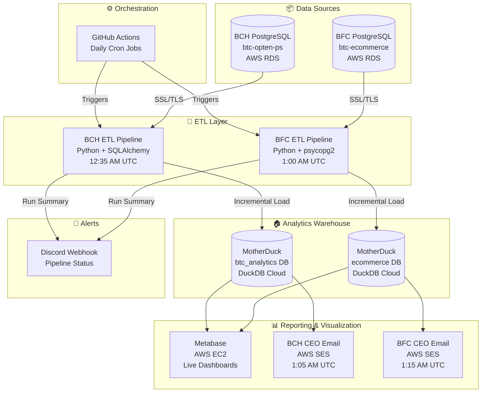
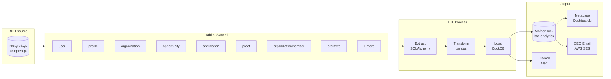
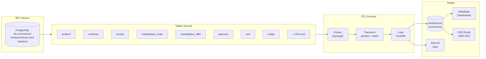

# btc-data-hub

> Automated Bitcoin data infrastructure — ETL pipelines, analytics warehouse, and daily reporting for **Bitcoin Culture Hub (BCH)** and **Bitcoin For Collectors (BFC)**.

---

## Architecture

```
PostgreSQL (AWS RDS)          MotherDuck (DuckDB Cloud)        Reporting
─────────────────────         ──────────────────────────       ──────────
  BCH Production DB    ──►    btc_analytics database    ──►    Daily Email (AWS SES)
  BFC Production DB    ──►    ecommerce database         ──►    Metabase Dashboards (AWS EC2)
                              
GitHub Actions orchestrates all pipelines on a daily schedule
```

---

## Stack

| Layer | Technology |
|---|---|
| Source | PostgreSQL on AWS RDS |
| Orchestration | GitHub Actions |
| Transformation | Python, pandas, SQLAlchemy |
| Warehouse | DuckDB + MotherDuck |
| Visualization | Metabase on AWS EC2 |
| Reporting | AWS SES (HTML email) |
| Alerts | Discord Webhooks |

---

## Pipelines

```
.github/workflows/
├── data-pipeline.yml        →  BCH ETL          (runs 12:35 AM UTC)
├── ecommerce-etl.yml        →  BFC ETL          (runs  1:00 AM UTC)
├── ceo-metrics.yml          →  BCH CEO Report   (runs  1:05 AM UTC)
└── ceo-metrics-bfc.yml      →  BFC CEO Report   (runs  1:15 AM UTC)
```

Each pipeline:
1. Spins up a GitHub Actions runner
2. Whitelists the runner IP on the RDS security group
3. Extracts data from PostgreSQL into pandas DataFrames
4. Loads into MotherDuck incrementally
5. Revokes the runner IP from the security group
6. Sends a Discord alert with the run summary

---

## Repository Structure

```
btc-data-hub/
├── .github/workflows/           # GitHub Actions pipeline definitions
├── CEO_METRICS/                 # BCH daily CEO metrics email
├── CEO_METRICS_BFC/             # BFC daily CEO metrics email
├── ecommerce-pipeline/          # BFC ETL script
├── main.py                      # BCH ETL script
├── requirements.txt
└── README.md
```

---

## Data Flow

```
                    ┌─────────────────────────────────────┐
                    │         GitHub Actions               │
                    │   (Scheduled daily cron jobs)        │
                    └────────────┬────────────────────────┘
                                 │
              ┌──────────────────┼──────────────────┐
              │                                     │
              ▼                                     ▼
   ┌─────────────────────┐             ┌─────────────────────┐
   │   BCH PostgreSQL    │             │   BFC PostgreSQL    │
   │   (AWS RDS)         │             │   (AWS RDS)         │
   └────────┬────────────┘             └────────┬────────────┘
            │                                   │
            ▼                                   ▼
   ┌─────────────────────┐             ┌─────────────────────┐
   │  btc_analytics DB   │             │   ecommerce DB      │
   │  (MotherDuck)       │             │   (MotherDuck)      │
   └────────┬────────────┘             └────────┬────────────┘
            │                                   │
            ▼                                   ▼
   ┌─────────────────────────────────────────────────────────┐
   │              Metabase (AWS EC2)                         │
   │         Live dashboards for both products               │
   └─────────────────────────────────────────────────────────┘
            │                                   │
            ▼                                   ▼
   ┌─────────────────┐                 ┌─────────────────┐
   │  BCH CEO Email  │                 │  BFC CEO Email  │
   │  (AWS SES)      │                 │  (AWS SES)      │
   └─────────────────┘                 └─────────────────┘
```

---

## Pipeline Flow



---

## BCH Pipeline Detail



---

## BFC Pipeline Detail



---

## Key Features

- **Incremental loading** — only new rows are inserted on each run, no full reloads
- **Schema drift detection** — tables are automatically recreated if the source schema changes
- **Dynamic IP whitelisting** — runner IP is added and removed from RDS security group on every run
- **Retry logic** — failed connections retry up to 3 times before alerting
- **Discord alerts** — every pipeline run posts a success or failure summary
- **Daily CEO email** — HTML metrics report delivered every morning via AWS SES
- **Metabase dashboards** — live analytics on top of MotherDuck via self-hosted Metabase on EC2

---

## Local Development

```bash
# Clone
git clone https://github.com/Bitcoin-Culture-Hub/btc-data-hub.git
cd btc-data-hub

# Install dependencies
pip install -r requirements.txt

# Copy and fill in environment variables
cp .env.example .env

# Run BCH pipeline
python main.py

# Run BFC pipeline
cd ecommerce-pipeline && python main.py
```

---

## Requirements

- Python 3.10+
- MotherDuck account
- AWS account with RDS and SES access
- PostgreSQL access to BCH and BFC production databases

---

## License

MIT